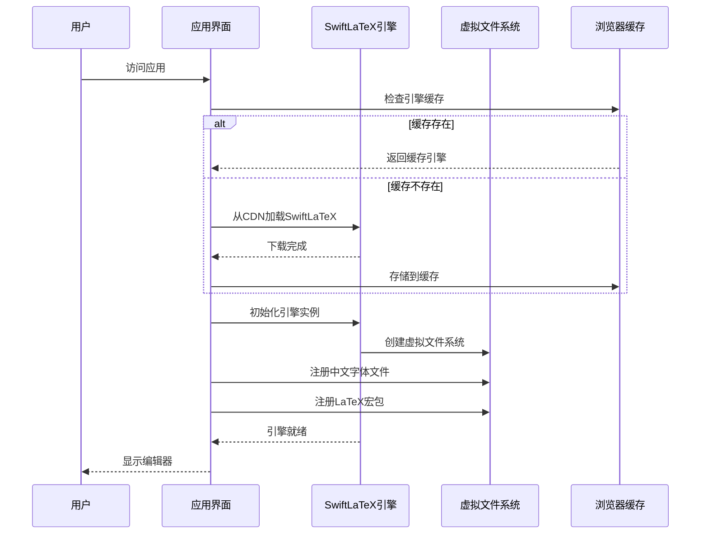
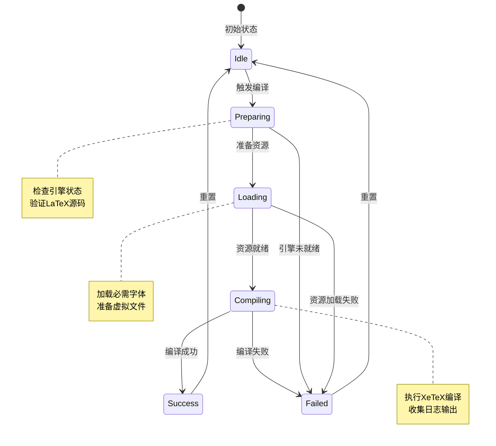
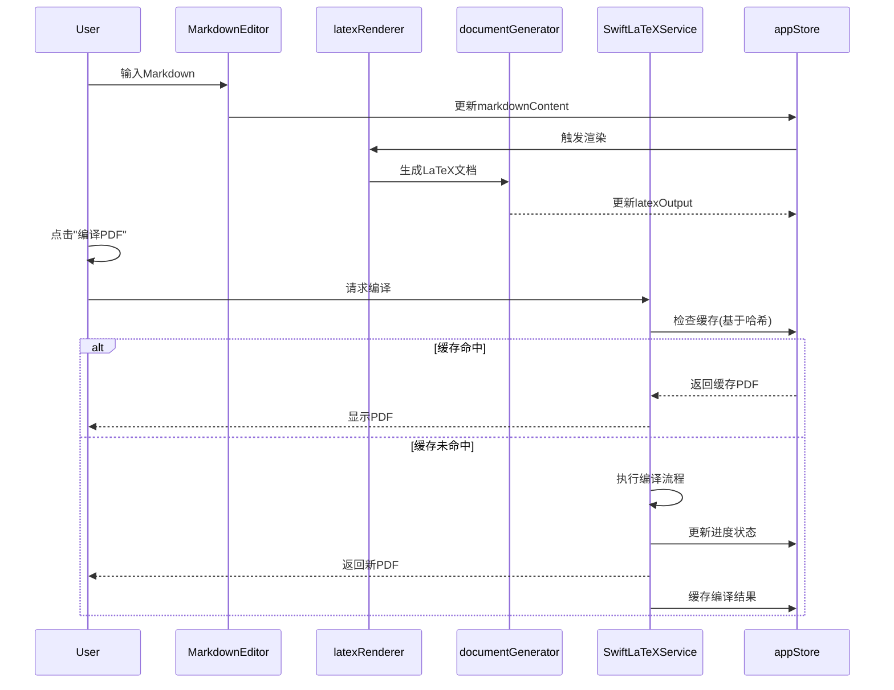

# 多平台部署与全功能前端化设计方案

## 一、背景与目标

### 1.1 现状分析

当前项目存在以下平台依赖性问题:

**Mac环境强依赖**
- 后端服务依赖系统级LaTeX环境(MacTeX/BasicTeX)
- 需要通过Homebrew安装和配置LaTeX工具链
- XeLaTeX编译器需要手动安装中文支持包(ctex、xecjk)
- 环境配置步骤复杂,跨平台迁移困难

**部署架构限制**
- 需要Node.js后端服务运行在3001端口
- 前端依赖后端API进行中文PDF编译
- 无法直接部署为纯静态站点到GitHub Pages
- 双模式编译逻辑复杂,前后端耦合度高

**现有双模式PDF编译机制**
- 前端: 使用WebAssembly的PDFTeX引擎(通过CDN加载texlive@1.2.0),不支持中文
- 后端: 使用node-latex调用系统XeLaTeX,支持中文但需要环境配置
- 策略: 优先前端编译,失败后自动切换后端

### 1.2 优化目标

**核心目标**
- 实现100%纯前端化的PDF编译能力,支持完整LaTeX语法(包括中文)
- 消除对后端服务和系统LaTeX环境的依赖
- 支持静态部署到GitHub Pages等平台
- 降低环境配置复杂度,实现开箱即用

**技术要求**
- 前端编译引擎需支持中文字体和CJK宏包
- 保持现有Markdown转LaTeX功能完整性
- 优化WebAssembly引擎加载和缓存策略
- 提供编译进度反馈和错误提示

## 二、技术方案选型

### 2.1 前端LaTeX编译引擎对比

| 方案 | 技术栈 | 中文支持 | 宏包支持 | 编译速度 | 部署体积 | 社区活跃度 |
|------|--------|----------|----------|----------|----------|------------|
| SwiftLaTeX | WebAssembly + XeTeX | ✅ 完整支持 | ✅ 丰富宏包 | 中等 | ~20MB | 活跃 |
| texlive.js | WebAssembly + PDFTeX | ❌ 不支持 | ⚠️ 基础宏包 | 快 | ~5MB | 较活跃 |
| LaTeX.js | JavaScript解释器 | ⚠️ 部分支持 | ❌ 有限 | 慢 | 小 | 一般 |

**推荐方案: SwiftLaTeX**

选择理由:
- 基于XeTeX引擎的WebAssembly移植,完整支持Unicode和中文字体
- 内置常用LaTeX宏包(ctex、xeCJK、booktabs等)
- 提供虚拟文件系统,支持字体和资源文件管理
- 编译质量与本地XeLaTeX一致
- 成熟的浏览器兼容性和错误处理机制

### 2.2 资源管理策略

**中文字体方案**

| 策略 | 字体来源 | 初始加载 | 优点 | 缺点 |
|------|----------|----------|------|------|
| CDN字体 | Google Fonts / 字体CDN | 按需加载 | 减小部署体积 | 依赖外部网络 |
| 内嵌字体包 | 随应用打包 | 一次性下载 | 完全离线可用 | 增加~10MB体积 |
| 混合策略 | 基础字体内嵌 + 扩展字体CDN | 渐进式加载 | 平衡体积与功能 | 实现复杂度较高 |

**推荐策略: 混合策略**
- 内嵌Noto Sans CJK SC Regular字体(约4MB压缩后)作为基础中文字体
- 其他字体变体(粗体、斜体)通过CDN按需加载
- 实现字体加载失败的降级方案

**宏包与引擎资源**

资源类型清单:
- SwiftLaTeX引擎核心文件(约15MB WebAssembly模块)
- 基础TeX宏包集合(LaTeX核心、常用文档类)
- 中文支持宏包(ctex、xeCJK、CJKpunct)
- 表格增强宏包(booktabs、tabularx、longtable)
- 数学公式宏包(amsmath、amssymb)

加载优化策略:
- 核心引擎采用Service Worker缓存,持久化存储
- 宏包采用虚拟文件系统按需注册
- 首次访问预加载核心资源,后续访问秒开

### 2.3 部署架构演进

**当前架构**

```
┌─────────────┐         ┌─────────────┐
│   前端应用   │  HTTP   │  后端服务    │
│  (Vite/React)│ ──────> │  (Express)   │
│             │         │             │
│ texlive.js  │         │ node-latex  │
│ (PDFTeX)    │         │ (XeLaTeX)   │
└─────────────┘         └─────────────┘
                              │
                              ↓
                        ┌─────────────┐
                        │ 系统LaTeX环境│
                        │ (MacTeX等)  │
                        └─────────────┘
```

**目标架构**

```
┌──────────────────────────────┐
│        前端应用(静态)          │
│       (Vite + React)         │
│                              │
│  ┌────────────────────────┐  │
│  │  SwiftLaTeX引擎        │  │
│  │  (WebAssembly + XeTeX) │  │
│  │                        │  │
│  │  - 虚拟文件系统        │  │
│  │  - 中文字体支持        │  │
│  │  - 完整宏包集          │  │
│  └────────────────────────┘  │
│                              │
│  ┌────────────────────────┐  │
│  │  Service Worker        │  │
│  │  (资源缓存与离线支持)   │  │
│  └────────────────────────┘  │
└──────────────────────────────┘
         │
         ↓ 部署到
┌──────────────────────────────┐
│      GitHub Pages /          │
│   任意静态托管平台             │
└──────────────────────────────┘
```

## 三、核心功能设计

### 3.1 SwiftLaTeX引擎集成

**引擎初始化流程**



**引擎服务接口设计**

服务职责划分:

**SwiftLaTeXService核心能力**
- 引擎生命周期管理(加载、初始化、清理)
- 编译任务调度与状态管理
- 虚拟文件系统操作(文件写入、读取、删除)
- 编译日志收集与解析
- 错误诊断与提示生成

**关键配置参数**

| 参数 | 类型 | 默认值 | 说明 |
|------|------|--------|------|
| engineUrl | string | CDN地址 | SwiftLaTeX引擎资源URL |
| fontFiles | Array | 中文字体列表 | 需要加载的字体文件路径 |
| compileCommand | string | 'xelatex' | 编译命令(xelatex/pdflatex) |
| maxCompileTime | number | 30000ms | 编译超时时间 |
| enableCache | boolean | true | 是否启用编译缓存 |
| errorLanguage | string | 'zh-CN' | 错误提示语言 |

### 3.2 中文字体支持实现

**字体资源管理策略**

字体文件准备:
- 选用开源字体Noto Sans CJK SC(思源黑体简体中文)
- 包含Regular、Bold两个字重,覆盖常规和加粗需求
- 采用woff2格式压缩,单文件约2MB

字体加载时机:
- 应用启动时预加载Regular字重(必需)
- 检测到加粗语法时按需加载Bold字重(可选)
- 使用FontFace API确保字体加载完成后再编译

**虚拟文件系统字体注册**

注册流程说明:
- 从CDN或本地资源加载字体文件为ArrayBuffer
- 通过SwiftLaTeX虚拟文件系统API注册字体
- 文件路径映射为TeX可识别的路径(如/fonts/NotoSansCJKsc-Regular.otf)
- 在LaTeX文档preamble中声明字体族和编码

字体声明示例模板:
- 使用fontspec宏包设置中文主字体
- 配置CJKmainfont为Noto Sans CJK SC
- 自动处理字体特性(粗体、斜体)映射

### 3.3 编译流程优化

**编译任务状态机**



**编译进度反馈机制**

进度阶段划分:

| 阶段 | 进度范围 | 预估耗时 | 用户提示 |
|------|----------|----------|----------|
| 引擎加载 | 0-20% | 2-5s | 正在初始化编译引擎... |
| 字体加载 | 20-40% | 1-3s | 正在加载中文字体... |
| 文件准备 | 40-50% | <1s | 准备LaTeX源文件... |
| 执行编译 | 50-90% | 3-10s | 正在编译文档... |
| 生成PDF | 90-100% | <1s | 生成PDF文件... |

实现方式:
- 使用事件发射器模式报告编译进度
- 在UI层展示进度条和当前阶段文字
- 支持编译取消操作(中断编译任务)

**错误处理与降级**

错误类型分类:

**引擎加载错误**
- 原因: 网络故障、CDN不可用、浏览器兼容性
- 处理: 重试加载、切换备用CDN、提示浏览器升级

**编译语法错误**
- 原因: LaTeX语法错误、未定义命令、宏包冲突
- 处理: 解析编译日志定位错误行、高亮错误位置、提供修复建议

**资源不足错误**
- 原因: 文档过大、编译超时、浏览器内存限制
- 处理: 分段编译、压缩资源、提示简化文档

**字体缺失错误**
- 原因: 字体加载失败、虚拟文件系统注册失败
- 处理: 降级使用系统字体、提示重新加载

### 3.4 性能优化策略

**资源缓存机制**

多层缓存架构:

**Service Worker缓存层**
- 缓存SwiftLaTeX引擎WebAssembly模块
- 缓存中文字体文件
- 缓存LaTeX宏包资源
- 采用Cache-First策略,优先使用缓存
- 设置缓存有效期为30天

**浏览器内存缓存层**
- 缓存已加载的引擎实例(单例模式)
- 缓存虚拟文件系统状态
- 缓存最近编译结果(LRU策略,保留3个)

**编译结果缓存**
- 基于LaTeX源码内容哈希判断是否需要重新编译
- 缓存键: SHA-256(latexContent + 配置参数)
- 缓存值: PDF Blob + 编译日志
- 源码未变化时直接返回缓存PDF

**首次加载优化**

资源加载优先级:
1. 核心引擎模块(关键路径,最高优先级)
2. 基础中文字体Regular(阻塞编译,高优先级)
3. UI组件和样式(影响首屏,中优先级)
4. 扩展字体和宏包(按需加载,低优先级)

加载策略:
- 使用资源预加载(link rel="preload")
- 关键资源内联到HTML(减少往返时间)
- 非关键资源懒加载
- 显示加载进度条(视觉反馈)

**编译性能优化**

编译加速技巧:
- 使用单次编译模式(passes=1)处理简单文档
- 检测文档是否包含引用、目录等,决定编译次数
- 复用虚拟文件系统,避免重复注册资源
- 使用Web Worker执行编译(不阻塞主线程)

内存管理:
- 编译完成后清理临时文件
- 及时释放不再使用的PDF Blob URL
- 限制编译历史记录数量
- 监控内存使用,超阈值时触发垃圾回收

## 四、数据流与组件重构

### 4.1 组件架构调整

**现有组件结构**

核心组件清单:
- MarkdownEditor: Markdown源码编辑器
- LatexPreview: LaTeX预览和PDF编译
- Toolbar: 工具栏(复制、下载、设置)
- SettingsPanel: 配置面板

当前问题:
- LatexPreview组件耦合双模式编译逻辑
- 后端服务可用性检测分散在组件层
- 编译状态管理复杂,代码可读性差

**优化后组件职责**

**LatexPreview组件简化**
- 职责聚焦: 仅负责UI展示和用户交互
- 移除后端服务检测逻辑
- 移除双模式切换逻辑
- 编译操作委托给统一的编译服务

**新增PdfCompiler组件**
- 封装SwiftLaTeX编译能力
- 提供统一的编译接口
- 管理编译状态和进度
- 处理错误和降级

**Toolbar增强**
- 新增离线模式指示器
- 显示编译引擎状态(就绪/加载中)
- 提供编译缓存清理功能

### 4.2 状态管理优化

**状态结构重构**

新增状态字段:

| 字段名 | 类型 | 说明 |
|--------|------|------|
| engineStatus | EngineStatus | 引擎状态(未加载/加载中/就绪/错误) |
| engineLoadProgress | number | 引擎加载进度(0-100) |
| compilationProgress | number | 编译进度(0-100) |
| compilationStage | string | 当前编译阶段描述 |
| cachedPdfHash | string \| null | 当前PDF对应的源码哈希 |
| fontLoadStatus | FontStatus | 字体加载状态映射表 |

移除状态字段:
- serverAvailable: 后端服务可用性(不再需要)
- compilationMode: 编译模式(统一为前端)

**状态流转逻辑**

引擎状态流转:
- 未加载 → 加载中(用户首次编译触发)
- 加载中 → 就绪(引擎和字体加载完成)
- 加载中 → 错误(加载失败)
- 错误 → 加载中(用户重试)

编译状态流转:
- 空闲 → 编译中(用户点击编译按钮)
- 编译中 → 成功(PDF生成完成)
- 编译中 → 失败(编译错误)
- 成功/失败 → 空闲(重置或重新编译)

### 4.3 服务层重构

**服务模块清单**

**SwiftLaTeXService(新增)**
- 引擎加载与初始化
- 字体资源管理
- LaTeX编译执行
- 虚拟文件系统操作
- 编译日志解析

**latexRenderer(保留)**
- Markdown解析
- LaTeX代码生成
- 表格智能处理
- 特殊字符转义

**documentGenerator(保留)**
- 文档结构生成
- 导言区配置
- 宏包声明管理

**exportService(保留)**
- LaTeX源码导出
- PDF文件下载
- 剪贴板复制

**移除服务**
- PdfCompileService: 后端编译服务(不再需要)
- frontendPdfService: 替换为SwiftLaTeXService

**服务交互流程**



## 五、部署与构建优化

### 5.1 构建配置调整

**Vite配置优化**

代码分割策略:
- 核心应用代码打包为主chunk
- SwiftLaTeX引擎作为独立chunk懒加载
- 中文字体文件单独打包为静态资源
- UI组件库(CodeMirror、React)作为vendor chunk

输出优化:
- 启用Gzip/Brotli压缩
- 生成资源清单(manifest.json)
- 配置长期缓存策略(contenthash命名)
- 生成Service Worker配置

环境变量配置:

| 变量名 | 开发环境 | 生产环境 | 说明 |
|--------|----------|----------|------|
| VITE_ENGINE_CDN | localhost | jsDelivr CDN | 引擎资源地址 |
| VITE_FONT_CDN | localhost | Google Fonts | 字体资源地址 |
| VITE_ENABLE_SW | false | true | 是否启用Service Worker |
| VITE_CACHE_VERSION | dev | v1.0.0 | 缓存版本号 |

### 5.2 静态资源管理

**资源文件清单**

必需资源(随应用打包):
- SwiftLaTeX引擎核心模块(约15MB)
- Noto Sans CJK SC Regular字体(约4MB)
- 基础LaTeX宏包集合(约2MB)
- 应用代码和UI资源(约1MB)

可选资源(CDN托管):
- 扩展字体变体(粗体、斜体等)
- 额外LaTeX宏包
- 示例文档模板

**CDN配置建议**

主CDN方案:
- jsDelivr: SwiftLaTeX引擎和宏包
- Google Fonts: 备用字体资源
- Cloudflare CDN: 字体和静态资源镜像

降级策略:
- CDN加载失败时回退到本地打包资源
- 多CDN轮询(jsDelivr → unpkg → cdnjs)
- 显示网络状态提示

### 5.3 GitHub Pages部署方案

**仓库结构**

推荐目录组织:
```
仓库根目录/
├── .github/
│   └── workflows/
│       └── deploy.yml        # 自动化部署流程
├── public/
│   ├── swiftlatex/          # 引擎资源
│   └── fonts/               # 字体文件
├── src/                     # 应用源码
└── dist/                    # 构建输出(gh-pages分支)
```

**自动化部署流程**

工作流触发条件:
- 推送到main分支
- 创建新的版本标签
- 手动触发部署

流程步骤说明:
1. 检出代码仓库
2. 安装Node.js依赖(使用缓存加速)
3. 执行Vite构建命令
4. 运行资源优化脚本(压缩、哈希)
5. 部署dist目录到gh-pages分支
6. 清理过期缓存

构建产物检查:
- 验证关键资源文件存在
- 检查资源总大小(限制<50MB)
- 生成部署报告

**自定义域名配置**

域名设置步骤:
- 在仓库设置中配置自定义域名
- 添加CNAME文件到public目录
- 配置DNS记录(A记录或CNAME)
- 启用HTTPS(GitHub自动颁发证书)

CDN加速建议:
- 使用Cloudflare作为CDN代理
- 配置缓存规则(静态资源缓存1年)
- 启用HTTP/2和Brotli压缩

### 5.4 多平台部署适配

**支持的部署平台**

| 平台 | 配置难度 | 自定义域名 | CDN加速 | CI/CD | 推荐度 |
|------|----------|------------|---------|-------|--------|
| GitHub Pages | 低 | ✅ | ⚠️(有限) | ✅ | ⭐⭐⭐⭐⭐ |
| Vercel | 低 | ✅ | ✅ | ✅ | ⭐⭐⭐⭐⭐ |
| Netlify | 低 | ✅ | ✅ | ✅ | ⭐⭐⭐⭐ |
| Cloudflare Pages | 中 | ✅ | ✅ | ✅ | ⭐⭐⭐⭐ |
| 阿里云OSS | 中 | ✅ | ✅ | ⚠️ | ⭐⭐⭐ |

**平台特殊配置**

Vercel部署配置:
- 设置输出目录为dist
- 配置构建命令为npm run build
- 设置环境变量(生产环境CDN地址)
- 启用边缘缓存(Edge Cache)

Netlify部署配置:
- 创建netlify.toml配置文件
- 配置重定向规则(SPA路由支持)
- 设置响应头(CORS、缓存策略)
- 启用资源优化(图片压缩、代码混淆)

## 六、向后兼容与迁移

### 6.1 过渡期兼容方案

**保留后端服务支持**

兼容性考虑:
- 部分用户可能依赖现有后端服务
- 提供平滑迁移期(建议3个月)
- 在设置中保留"使用后端编译"选项

检测逻辑:
- 应用启动时检测后端服务可用性
- 可用时在设置中显示切换选项
- 不可用时自动使用纯前端模式

配置项:
- compileMode: 'auto' | 'frontend-only' | 'backend-fallback'
- auto: 自动选择(默认前端,失败时尝试后端)
- frontend-only: 强制使用前端编译
- backend-fallback: 优先后端,失败时前端

### 6.2 数据迁移策略

**本地存储兼容**

现有数据结构:
- localStorage保存的用户配置
- 编辑器历史记录
- 最近使用的Markdown文档

迁移处理:
- 读取旧配置并映射到新字段
- 移除废弃的配置项(serverAvailable等)
- 添加默认值到新增配置项

版本标识:
- 在localStorage中记录配置版本号
- 首次加载时检测版本并执行迁移脚本
- 迁移完成后更新版本号

### 6.3 用户通知与文档更新

**应用内更新提示**

提示时机:
- 用户首次访问新版本时显示更新说明
- 检测到后端服务不可用时提示已切换前端模式
- 首次编译成功后显示性能对比

提示内容:
- 新版本主要改进(纯前端化、性能提升)
- 功能对比说明(中文支持、离线可用)
- 已知限制(浏览器兼容性要求)

**README文档更新**

需要调整的章节:
- 快速开始: 简化为单步骤(npm install && npm run dev)
- 删除后端服务配置章节(macOS环境配置等)
- 新增浏览器兼容性说明
- 更新部署指南(GitHub Pages步骤)
- 添加离线使用说明

新增说明内容:
- SwiftLaTeX引擎介绍
- 首次加载时间预期(资源下载)
- 缓存机制说明(加速后续访问)
- 故障排查指南(清除缓存、浏览器升级)

## 七、测试与验证

### 7.1 功能测试清单

**编译功能测试**

基础功能测试用例:
- 纯英文文档编译
- 包含中文的文档编译
- 数学公式渲染
- 复杂表格(tabularx、longtable)
- 代码块语法高亮
- 图片引用(base64嵌入)

边界情况测试:
- 空文档编译
- 超大文档(>1000行)编译
- 包含特殊字符的文档
- 无效LaTeX语法处理
- 编译超时处理

**性能测试**

关键指标测量:

| 测试场景 | 目标指标 | 测试方法 |
|----------|----------|----------|
| 首次加载时间 | <8s (快速网络) | 测量从访问到编辑器可用 |
| 引擎初始化 | <3s | 测量引擎加载完成时间 |
| 中文编译耗时 | <10s (500行) | 计时从开始编译到PDF生成 |
| 缓存命中响应 | <1s | 测量缓存PDF返回时间 |
| 内存占用 | <200MB | 浏览器任务管理器监控 |

性能优化验证:
- Service Worker缓存命中率 >90%
- 重复访问加载时间 <2s
- 编译结果缓存有效性100%

### 7.2 兼容性测试

**浏览器兼容性矩阵**

| 浏览器 | 最低版本 | 核心功能 | PDF编译 | 离线支持 | 备注 |
|--------|----------|----------|---------|----------|------|
| Chrome | 90+ | ✅ | ✅ | ✅ | 推荐浏览器 |
| Edge | 90+ | ✅ | ✅ | ✅ | 基于Chromium |
| Firefox | 88+ | ✅ | ✅ | ✅ | 需测试WASM性能 |
| Safari | 14+ | ✅ | ⚠️ | ⚠️ | 部分功能受限 |
| Safari iOS | 14+ | ✅ | ⚠️ | ❌ | 移动端限制 |

兼容性问题处理:
- Safari的WebAssembly内存限制问题
- iOS的Service Worker限制
- Firefox的字体加载策略差异
- 提供浏览器检测和降级提示

**设备测试**

测试设备清单:
- 桌面端: Windows、macOS、Linux
- 移动端: iOS(iPhone/iPad)、Android
- 屏幕尺寸: 1920x1080、1366x768、移动端375x667

响应式适配验证:
- 编辑器在小屏幕上的可用性
- PDF预览的缩放和滚动
- 移动端编译性能

### 7.3 部署验证

**GitHub Pages部署检查**

部署后验证项:
- 所有静态资源加载成功(无404错误)
- Service Worker正确注册
- 首次访问功能完整可用
- 离线模式正常工作
- 自定义域名HTTPS正常

CDN资源验证:
- SwiftLaTeX引擎从CDN加载成功
- 字体文件正确加载
- CDN故障时降级到本地资源

性能监控:
- 使用Lighthouse评分 >90分
- First Contentful Paint <2s
- Time to Interactive <5s
- 资源总大小 <25MB(首次加载)

## 八、风险评估与应对

### 8.1 技术风险

**SwiftLaTeX引擎依赖风险**

风险描述:
- SwiftLaTeX项目维护活跃度下降
- CDN源失效或访问受限
- 引擎存在未知Bug影响编译质量

应对措施:
- Fork SwiftLaTeX仓库到项目组织
- 自建CDN镜像,提供备用加载地址
- 建立引擎版本锁定机制
- 准备替代引擎方案(texlive.js降级方案)

**浏览器兼容性风险**

风险描述:
- 旧版本浏览器不支持WebAssembly
- 移动端浏览器性能不足
- Safari的限制性策略

应对措施:
- 提供浏览器检测和升级提示
- 移动端显示"建议在桌面端使用"提示
- 针对Safari优化内存使用
- 提供精简版编译模式(禁用部分功能)

### 8.2 用户体验风险

**首次加载缓慢**

风险描述:
- 首次访问需下载约20MB资源
- 慢速网络用户体验差
- 用户可能在加载完成前离开

应对措施:
- 显示详细的加载进度和时间估计
- 提供"跳过PDF编译"选项,仅使用LaTeX预览
- 优化资源压缩率(Brotli压缩)
- 添加离线下载安装包选项

**编译失败用户困惑**

风险描述:
- LaTeX错误提示对普通用户不友好
- 用户不理解编译失败原因
- 缺乏有效的故障排查指引

应对措施:
- 编译错误提示本地化和简化
- 提供常见错误解决方案链接
- 增加"一键修复"功能(自动调整文档配置)
- 添加示例文档和最佳实践指南

### 8.3 性能风险

**大文档编译性能问题**

风险描述:
- 超大文档(>2000行)编译耗时过长
- 浏览器内存不足导致崩溃
- 移动端设备无法完成编译

应对措施:
- 对大文档显示警告和性能提示
- 实现文档分段编译功能
- 设置文档大小上限(可配置)
- 提供"轻量编译模式"(减少编译次数)

**缓存失效问题**

风险描述:
- Service Worker缓存策略不当
- 用户清除缓存导致需重新下载
- 缓存版本管理混乱

应对措施:
- 缓存版本号与应用版本绑定
- 提供缓存管理界面(查看、清除)
- 实现渐进式缓存更新
- 关键资源使用持久化缓存

## 九、实施计划

### 9.1 开发阶段划分

**第一阶段: 引擎集成(预计2周)**

任务清单:
- 研究SwiftLaTeX API和示例
- 创建SwiftLaTeXService服务模块
- 实现引擎加载和初始化逻辑
- 完成基础编译功能(英文文档)
- 编写单元测试

交付物:
- 可用的SwiftLaTeXService模块
- 基础编译功能演示
- API文档和使用示例

**第二阶段: 中文支持(预计1周)**

任务清单:
- 选择和准备中文字体文件
- 实现字体加载和注册逻辑
- 配置ctex和xeCJK宏包
- 测试中文编译功能
- 优化字体加载性能

交付物:
- 完整支持中文的编译能力
- 字体管理文档
- 中文编译测试用例

**第三阶段: 组件重构(预计1.5周)**

任务清单:
- 重构LatexPreview组件
- 更新状态管理结构
- 移除后端服务相关代码
- 实现编译进度反馈UI
- 更新工具栏和设置面板

交付物:
- 优化后的组件代码
- 更新的UI界面
- 组件测试覆盖

**第四阶段: 性能优化(预计1周)**

任务清单:
- 实现Service Worker缓存
- 配置编译结果缓存
- 优化资源加载策略
- 实现Web Worker编译
- 性能测试和调优

交付物:
- 性能测试报告
- 优化前后对比数据
- 缓存策略文档

**第五阶段: 部署配置(预计1周)**

任务清单:
- 配置Vite构建优化
- 编写GitHub Actions工作流
- 配置Service Worker生成
- 测试GitHub Pages部署
- 准备多平台部署文档

交付物:
- 自动化部署流程
- 部署文档和指南
- 成功部署的演示站点

**第六阶段: 测试与文档(预计1周)**

任务清单:
- 全面功能测试
- 浏览器兼容性测试
- 性能基准测试
- 更新README和用户文档
- 编写迁移指南

交付物:
- 测试报告
- 完整的用户文档
- 迁移指南

### 9.2 里程碑节点

| 里程碑 | 预计时间 | 验收标准 |
|--------|----------|----------|
| M1: 基础编译可用 | 第2周末 | 英文文档可正常编译为PDF |
| M2: 中文支持完成 | 第3周末 | 中文文档编译质量与XeLaTeX一致 |
| M3: 前端化重构完成 | 第5周中 | 移除所有后端依赖,功能完整 |
| M4: 性能优化达标 | 第6周中 | 首次加载<8s,缓存命中<2s |
| M5: 部署上线 | 第7周末 | GitHub Pages成功部署,功能可用 |
| M6: 正式发布 | 第8周末 | 所有测试通过,文档齐全 |

### 9.3 资源需求

**人力资源**

角色分工:
- 前端开发工程师: 2人(组件开发、服务集成)
- 性能优化工程师: 1人(缓存策略、构建优化)
- 测试工程师: 1人(功能测试、兼容性测试)
- 技术文档工程师: 0.5人(文档编写和维护)

**技术资源**

开发工具:
- Node.js 18+开发环境
- 现代浏览器(Chrome、Firefox开发者版)
- 性能分析工具(Lighthouse、WebPageTest)

测试设备:
- 多操作系统测试机(Windows、macOS、Linux)
- 移动设备(iOS、Android各1-2台)
- 网络限速工具(模拟慢速网络)

**外部依赖**

开源项目:
- SwiftLaTeX引擎
- Noto Sans CJK字体
- Vite和相关插件

CDN服务:
- jsDelivr(主CDN)
- unpkg(备用CDN)
- Google Fonts(字体备用)

## 十、监控与维护

### 10.1 运行监控指标

**性能监控**

关键指标定义:

| 指标名称 | 计算方式 | 目标值 | 告警阈值 |
|----------|----------|--------|----------|
| 页面加载时间 | FCP到TTI | <5s | >8s |
| 引擎初始化时间 | 开始加载到就绪 | <3s | >5s |
| 平均编译耗时 | 编译开始到完成 | <8s | >15s |
| 缓存命中率 | 缓存访问/总访问 | >85% | <70% |
| 编译成功率 | 成功次数/总次数 | >95% | <90% |

数据收集方式:
- 使用Performance API收集性能数据
- 在关键流程埋点记录时间戳
- 将数据上报到分析服务(如Google Analytics)
- 生成每日性能报告

**错误监控**

错误分类:
- 引擎加载失败
- 字体加载失败
- 编译语法错误
- 浏览器兼容性错误
- 网络请求失败

错误上报内容:
- 错误类型和消息
- 堆栈跟踪
- 浏览器和设备信息
- LaTeX源码哈希(用于复现)
- 用户配置信息

### 10.2 用户反馈收集

**反馈渠道**

渠道设置:
- 应用内反馈按钮(直接提交问题)
- GitHub Issues(功能请求和Bug报告)
- 用户调查问卷(定期发送)
- 使用分析(行为数据收集)

反馈内容分类:
- 功能请求
- Bug报告
- 性能问题
- 文档改进
- 用户体验建议

### 10.3 维护计划

**日常维护任务**

每周任务:
- 检查错误日志和性能数据
- 处理新提交的Issues
- 更新依赖库版本(安全补丁)
- 备份用户反馈数据

每月任务:
- 性能报告分析和优化
- 浏览器兼容性复测
- 更新文档和FAQ
- 评估新功能需求

**版本更新策略**

版本号规则:
- 主版本号: 架构重大变更
- 次版本号: 新功能添加
- 修订号: Bug修复和小优化

更新周期:
- 紧急修复: 发现后24小时内发布
- 常规更新: 每2周发布一次
- 功能更新: 每1-2个月发布一次

更新流程:
- 代码审查和测试
- 更新CHANGELOG
- 发布GitHub Release
- 自动触发部署
- 通知用户更新

---

## 信心评估

**信心等级: 高**

**信心依据**

技术可行性确认:
- SwiftLaTeX是成熟的WebAssembly LaTeX引擎,已有成功案例
- 项目现有架构清晰,重构风险可控
- 浏览器对WebAssembly和Service Worker支持已普及
- 类似的纯前端LaTeX编辑器已验证方案可行性

实施风险可控:
- 开发任务清晰,无重大技术难点
- 性能优化策略明确,有成熟的工具支持
- 部署流程标准化,GitHub Pages稳定可靠
- 提供了完整的降级和容错机制

预期收益明确:
- 彻底解决Mac环境依赖问题
- 实现静态部署,降低运维成本
- 提升用户体验(离线可用、更快响应)
- 简化开发和部署流程

**潜在挑战**

需要重点关注的问题:
- 首次加载性能优化(20MB资源下载)
- Safari浏览器的兼容性限制
- 大文档编译的性能瓶颈
- 用户从双模式到纯前端的适应过渡
